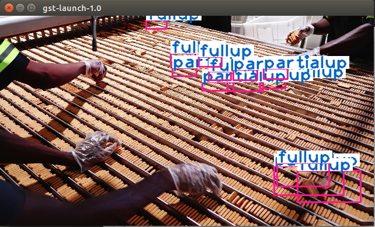
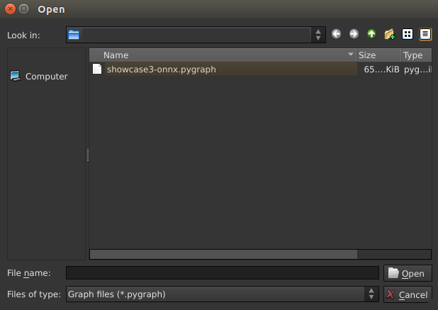
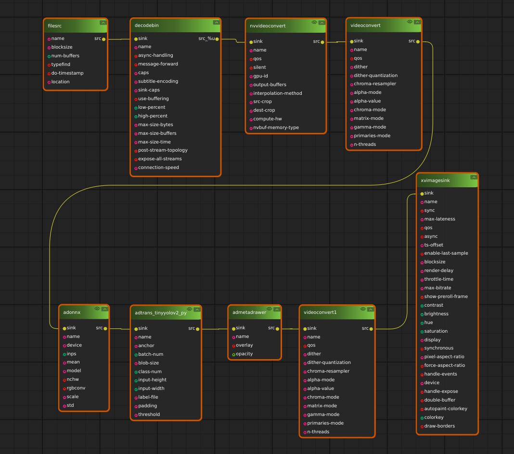

# Showcase 3: Cookie inspection

## Showcase Requirements

Before installing this showcase to the device, please install ADLINK EVASDK and set the EVA environment as necessary.

## Showcase 3 Installation

The path to the respective demo folder includes install.sh and run.sh for each showcase.

Install.sh will perform the following steps:

1. Download the demo video.
2. Download the inference ONNX model file and label file.
3. Download the required showcase demo videos and plug-in setup files.

### For this showcase: 

Use the path:

```
> cd src/demo/cookie-inspection
```

Run install.sh with root privileges:

```
> ./install.sh
```


This is required to modify the path to the OpenCV library. If you have installed EVA on a non-ADLINK device, please check the requirements in our EVA portal.

<a id="runsh"></a>

After installation, execute run.sh for the pipeline command:

```
> ./run.sh
```


Or you can open EVA_IDE and load pygraph then execute, please see the section, [Run This Showcase Through EVA IDE](#Run-This-Showcase-Through-EVA-IDE).

Then you will see the pop-up display window of this showcase as in the example below.



*Modified installation details can be found at the EVA Portal: < Under Construction >

## Training Materials

The training materials can be downloaded with the following links.

Training images: http://ftp.adlinktech.com/image/EVA/EVA_Show-Case/training/showcase3/cookie-training-images.zip 

Training notation for ONNX: http://ftp.adlinktech.com/

Training architecture site list below: 

Azure Custom Vision: 

https://www.customvision.ai/

Sample scripts for exported models from Custom Vision

https://github.com/Azure-Samples/customvision-export-samples

Sample script for CustomVision's ONNX Object Detection model

https://github.com/Azure-Samples/customvision-export-samples/tree/main/samples/python/onnx/object_detection

*Sign up the Azure Service can be found at this page 
https://azurelessons.com/create-azure-free-account/#Create_Azure_Free_Account

*Creat new project in Custom Vision can be found at the EVA Portal: < Under Construction >

<a id="Run-This-Showcase-Through-EVA-IDE"></a>
## Run This Showcase Through EVA IDE(For EVASDK 3.5.2 or later)

In this showcase, you can run the pipeline by execute <a href="#runsh">run.sh</a> but also EVA IDE. Open EVA IDE and make sure your current path is in src/demo/cookie-inspection as root:

```
> EVA_ROOT/bin/EVA_IDE
```

EVA_ROOT is the path where the EVA is installed, the default installed path is /opt/adlink/eva/. So directly call EVA_IDE:

```
> /opt/adlink/eva/bin/EVA_IDE
```

And you will see the IDE show up as below:


Then select the pygraph you want to run, here for example select showcase3-onnx.pygraph in this showcase folder through File->Load. Then you can see this showcase pipeline:





Then press the play button  and you will see the scenario video start to play.


