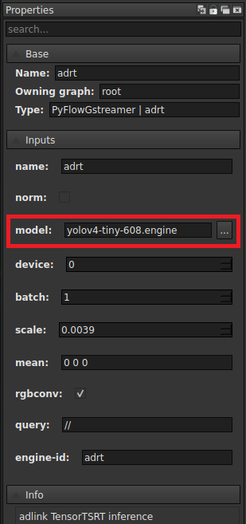

# Showcase 5: Parts Assembly

## Showcase Requirements

Before installing this showcase to the device, please install ADLINK EVASDK and set the EVA environment as necessary.

## Showcase 5 Installation

The path to the respective demo folder includes install.sh and run.sh for this showcase.

Install.sh will perform the following steps:

1. Build the required plug-ins for this showcase and install them into ADLINK EVASDK.
2. Download required demo videos and inference intermediate model file (*.etlt*) and its label file.
3. Check cmake version and installed it with minmum required version. (This takes time for building)
4. Build TensorRT required feature layers into plugin from NVIDIA *Open Source Software(OSS)*. (This takes time for building)
5. Optimize it to TensorRT format (*.engine*) on the local device.
6. Install required python packages.

For this showcase now only support for NVIDIA device.

### For this showcase: 

Use the path:

```
> cd src/demo/part-assembly
```

<!---

For Windows, (under construct)

```
> cd src\demo\part-preparation\windows
```

--->

For NEON JNX, please install this demo by:

Run install.sh with root privileges:

```
> ./install.sh
```

For x86 system, please install this demo by:

Run install.sh with root privileges:

```
> ./install.sh -g x86
```

<!---

For Windows: (under construct)

```
> install-win.bat
```

--->

This is required to modify the path to the OpenCV library. If you have installed EVA on a non-ADLINK device, please check the requirements in our EVA portal.

<!---

For Windows: (under construct)

```
> install-win.bat yolov3
```

--->

<a id="runsh"></a>

After installation, execute run.sh for the pipeline command:

```
> ./run.sh
```

This showcase utilizes the DSSD (Deconvolutional Single Shot Detector) and is trained by NVIDIA TAO. Two models which pruned and without pruned are provided. The default used model is without pruned when running. Use the command below to run pruned model:

```
> ./run.sh yes
```

<!---

For Windows: (under construct)

```
> run-win.bat
```

--->

Or you can open EVA_IDE and load pygraph then execute, please see the section, [Run This Showcase Through EVA IDE](#Run-This-Showcase-Through-EVA-IDE).

Then you will see the pop-up display window of this showcase as in the example below. There are three demo videos which will run one after the other.


In the figure above, "container-semi-finished-products" is the area where each parts must place inside. The order and the number of each part is already defined in SOP(Standard Operating Procedure). Based on this SOP, the algorithm designed six required steps orderly:

1. "semi-product in container"

   This part is default placed and will not gain any time.

2. "2 light-guide-cover(left and right)"

   Each light-guide-cover placed at right and left side individually.

3. "2 small-board-side-B(left and right)"

   These two parts required to placed onto the right and left light-guide-cover.

4. "screw on 4 screws(2 on left, 2 on right)"

   Screw on four screws separately on "small-board-side-B". Two on left and rest on right.

5. "put wire on"

   Put the wire component on the "semi-finished-product".

6. "final visual inspection"

   Final Check step 3 ~ step 5 for common final visual inspection.

The timer starts when the "semi-finished-product" is placed. In the videos, the "semi-finished-product" is default placed so that the timer will start calculating when video is running. If the operator place the part then stop doing anything exceed the defined SOP time.(Here the step 3 must complete in 6 seconds in algorithm) The idling message will display in the rest frame. (See the figure below).


If the step is operating/finished/waiting, the description is outlined in yellow/green/white. When each step is finished, the next step will start to run the timer till the last step is finished. This showcase illustrate the procedure of the operator followed the assembly specification in case the idling is occurred. Just like the other showcase, once you modified this part-assembly plugin source code, required to rebuild it simply direct to the path [/src/plugins/assembly](/src/plugins/assembly) and run assembly-build.sh for ubuntu system. (Currently not support for windows, windows version of this showcase will provide in later version) The email alert plugin were implemented in python. Once modified the email alert plugin, direct to [/src/plugins/alert/email](/src/plugins/alert/email) and run email-build.sh for ubuntu or email-build.bat for windows 10. The same rebuild procedure for other alert plugins. More detail setting could be found in EVA Portal.

*Modified installation details can be found at the EVA Portal: < Under Construction >

## Combination with Part Preparation(showcase 4)

Ultimately, the convenient combination with showcase 4 for illustrating the two SOP algorithm plug and play in EVA. Execute run-combination.sh for the pipeline command:

```
> ./run-combination.sh
```

Also, If supposed to run pruned model. Use the command below to run:

```
> ./run-combination.sh yes
```

Then, there will display the combination result. Prepare the parts first described in showcase 4 when ready then start calculating the assembly time describe above in this showcase. For simulating the scenario, three showcase 4 and showcase 5 videos are concated into three videos for illustrating which two are normal SOP process and one is the idling situation occurred. 

| Part Preparation                                             | Ready                                                        | Assembly                                                     |
| ------------------------------------------------------------ | ------------------------------------------------------------ | ------------------------------------------------------------ |
|  |  |  |

| Complete                                                     | Idling                                                       |
| ------------------------------------------------------------ | ------------------------------------------------------------ |
|  |  |

The whole procedure are simply illustrated above to show each status. The two plug-ins are connected convenience once the designed algorithm is completed. If more steps are concerned in whole SOP, more customized plug-ins could be designed and plugged into the pipeline much more convenient. 

## Training Materials

The training materials can be downloaded with the following links.

Training images and its label: http://sftp.adlinktech.com/image/EVA/EVA_Show-Case/training/showcase4-5/train-data.zip 

Reference training settings followed by NVIDIA TAO:  http://sftp.adlinktech.com/image/EVA/EVA_Show-Case/training/showcase4-5/files.zip 

Training procedure followed by [NVIDIA Train, Adapt, and Optimize(TAO)](https://developer.nvidia.com/tao-toolkit). The model architecture used for this demo is [Deconvolutional Single Shot Detector(DSSD) provided pretrained by TAO](https://docs.nvidia.com/tao/tao-toolkit/text/object_detection/dssd.html). 

Note: Showcases 4 and 5 use the same training materials.


## Run This Showcase Through EVA IDE(For EVASDK 3.5.2 or later)

In this showcase, you can run the pipeline by execute <a href="#runsh">run.sh</a> but also EVA IDE. Open EVA IDE and make sure your current path is in src/demo/part-preparation as root:

```
> EVA_ROOT/bin/EVA_IDE
```

EVA_ROOT is the path where the EVA is installed, the default installed path is /opt/adlink/eva/. So directly call EVA_IDE:

```
> /opt/adlink/eva/bin/EVA_IDE
```

And you will see the IDE show up as below:


Then select the pygraph you want to run, here for example select showcase5.pygraph in this showcase folder through File->Load. Then you can see this showcase pipeline:


For loading other videos, simply change the filesrc element and select the demo video in location property.

 

For loading pruned model, simply change the adrt element and select the pruned model in model property.

 

Click on the email_alert node in the pipeline and the property window will show the node properties detail at left side. See the figure below:

 

Provide an email address you want to receive from the alert for this show case in "receiver-address". Then press the play button  and you will see the scenario video start to play.

For combination pygraph file, select showcase5-combination.pygraph in this showcase folder through File->Load similarly. Rest modification are the same as showcase5.pygraph described above.

If your IDE can not show/add the plugin node "partpreparation" or "partassembly" after loading the pygraph file, manually add it into the while list. The file element_list.txt will be generated after running IDE once. 

For Linux, add "assembly" in file : /home/USER_ACCOUNT/adlink/eva/IDE/config/element_list.txt. 

<!---

<a id="note1"></a>

For Windows 10, add "partpreparation" in file : C:\ADLINK\eva\IDE\config\element_list.txt

--->
