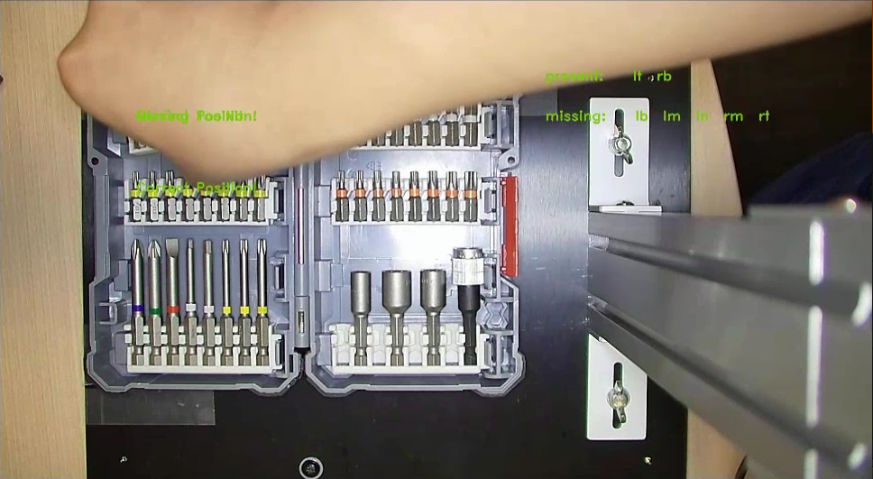
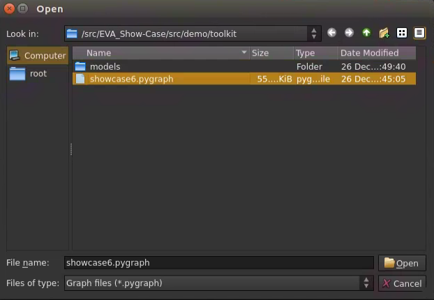
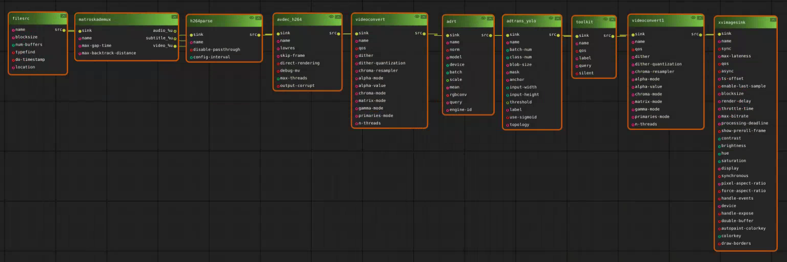

# Showcase 6: Toolkit

## Showcase Requirements

Before installing this showcase to the device, please install ADLINK EVASDK and set the EVA environment as necessary.

## Showcase 6 Installation

The path to the respective demo folder includes install.sh and run.sh for each showcase.

Install.sh will perform the following steps:

1. Build the required plug-ins for each showcase and install them into ADLINK EVASDK.
2. Download the inference intermediate model file and convert it to TensorRT format on the local device.
3. Download the required showcase demo videos and plug-in setup files.
### Make sure execute all [steps](https://github.com/IST-EVA-Support/EVA_Show-Case/tree/dev#clone-the-source-code) before installation.

### For this showcase: 

Use the path:

```
> cd src/demo/toolkit
```


Run install.sh with root privileges:

```
> ./install.sh
```


This is required to modify the path to the OpenCV library. If you have installed EVA on a non-ADLINK device, please check the requirements in our EVA portal.


<a id="runsh"></a>

After installation, execute run.sh for the pipeline command:

```
> ./run.sh
```

This demo shows how to output the inference result of the model. The output labels are the same that are used during the training. 

Or you can open EVA_IDE and load pygraph then execute, please see the section, [Run This Showcase Through EVA IDE](#Run-This-Showcase-Through-EVA-IDE).

Then you will see the pop-up display window of this showcase as in the example below.[ [Remember to add "toolkit" in element_list.txt](#element_list) ]



If the toolkit is missing it is shown on frame where its missing, additionally the missing and correct positions labels are also displayed. 
Display code meanings:

```
  lb -> left bottom
  lm -> left middle
  lu -> left upper
  rb -> right bottom
  rm -> right middle
  ru -> right upper
```

*Modified installation details can be found at the EVA Portal: https://eva-support.adlinktech.com/

## Training Materials

The training materials can be downloaded with the following links.

Training video: 

We labeled this training data through Roboflow. Once the data is annotated. We train this from our prepared training docker, please refer to the ai quick start suite for further information here.

<a id="Run-This-Showcase-Through-EVA-IDE"></a>

## Run This Showcase Through EVA IDE(For EVASDK 3.5.2 or later)

In this showcase, you can run the pipeline by execute <a href="#runsh">run.sh</a> but also EVA IDE. Open EVA IDE and make sure your current path is in src/demo/toolkit as root:

```
> EVA_ROOT/bin/EVA_IDE
```

EVA_ROOT is the path where the EVA is installed, the default installed path is /opt/adlink/eva/. So directly call EVA_IDE:

```
> /opt/adlink/eva/bin/EVA_IDE
```

And you will see the IDE show up as below:


Then select the pygraph you want to run through File->Load. 



Then you can see this showcase pipeline:



Then press the play button  and you will see the scenario video start to play.


<a id="element_list"></a>

For Linux, add "toolkit" in file : /home/USER_ACCOUNT/adlink/eva/IDE/config/element_list.txt.
(If you are using docker container instead of native run, path to ~/adlink/eva/IDE/config/element_list.txt)

